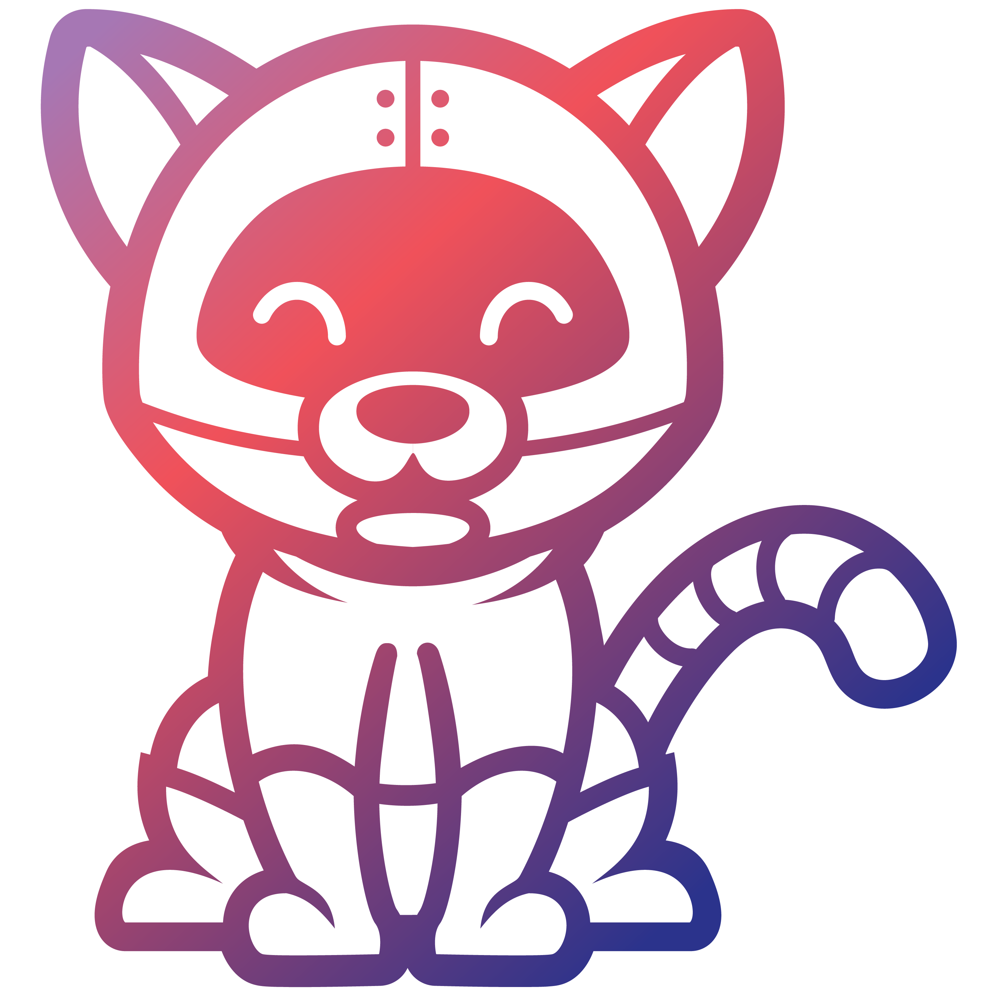
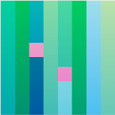

<h2>Welcome to my playground</h2>

<ul>
<li><g-emoji class="g-emoji" alias="seedling" fallback-src="https://github.githubassets.com/images/icons/emoji/unicode/1f331.png">🐍</g-emoji> I’m a Python Back-end  developer</li>
<li><g-emoji class="g-emoji" alias="dancers" fallback-src="https://github.githubassets.com/images/icons/emoji/unicode/1f46f.png">🤝</g-emoji> I want to exchange knowledge with others about different technologies </li>
<li><g-emoji class="g-emoji" alias="thinking" fallback-src="https://github.githubassets.com/images/icons/emoji/unicode/1f914.png">✅</g-emoji> Goals: Dive deeper into this amazing world of IT</li>

</ul>
 
<!--

 

  -->

 

<h2> Languages and Tools  </h2>

<!-- 

-->

<!--  -->
<!--  -->

<!--  -->

<!--  -->

<!--  -->
<!--  -->
<!--  -->

<!--  -->
<!--  -->
<!--  -->
<!--  -->
<!--  -->
<!-- 

 -->
<!--  -->

<h2> Connect with me </h2>

 

 
<h2>⚡ GitHub Stats</h2>
<!--  -->

<!--  -->

  
 
